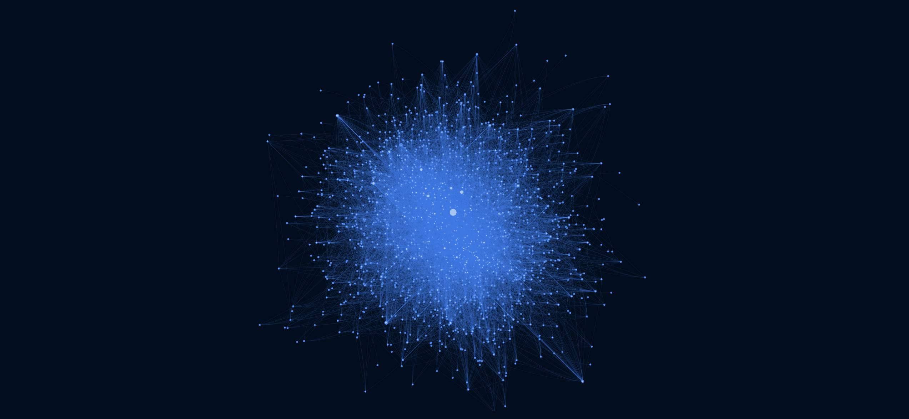

# A network visualization generated from the Science Twitter Graph

As of Elmos takeover of Twitter, John Beatty ([Twitter](https://twitter.com/john_d_beatty), [Mastodon](https://social.coop/@beatty)) started to collect the ORCID handles and followings of researchers on Twitter to preserve the "Science Twitter Graph".  

I spontaneously wrote some Python code that creates an interactive network visualization from the OpenCheck data. You can search for your own ORCID ID in the top menu and when you hover over nodes, a link to the respective ORCID page pops up. The network might take some time to load. Especially when you recreate it, there might be a lot more nodes and edges. As of the commit, the network consisted of 641 users with 4995 connections between them. 

### *[TO THE NETWORK](https://leonlotter.de/twittergraph/graph.html)*

Data source: [OpenCheck](https://opencheck.is/scitwitter)   
Code Package: [pyvis](https://pyvis.readthedocs.io/) based on [visjs](https://visjs.org/)  
License: [CC0](https://creativecommons.org/share-your-work/public-domain/cc0/)  

You can find me at [Twitter](https://twitter.com/LeonDLotter) and [Mastodon](https://fediscience.org/@LeondLotter).

### The network

<iframe style="width:100%; height:400px" src="https://www.leonlotter.de/twittergraph/graph.html"></iframe>

### The edge-contest winner

